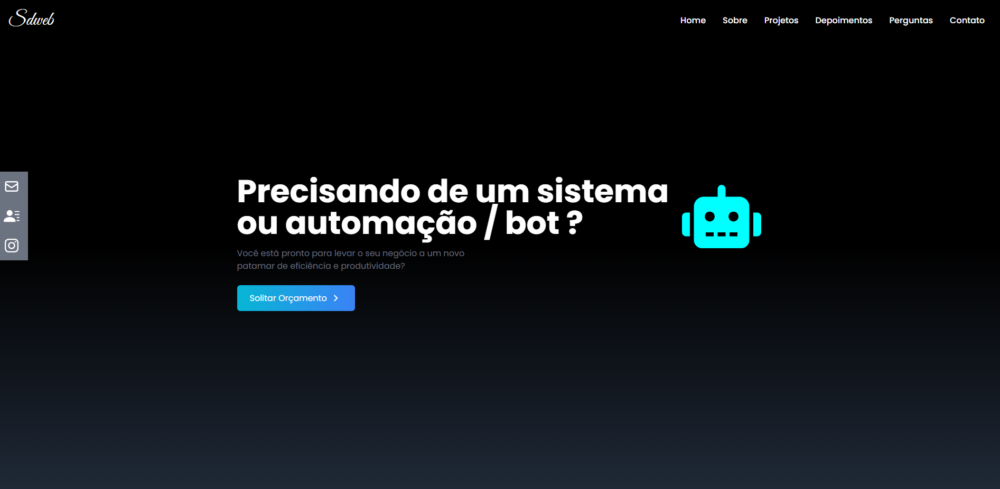

# Portfolio Freelancer 

Sdweb é um site de portfólio freelancer totalmente responsivo, compatível com todos os dispositivos. O site oferece serviços de automações de processos a fim de simplificar tarefas repetitivas e melhorar a produtividade.🚀

## Demo




## Instalação

🛠 Para instalar esse portfólio você só precisa usar esses comandos abaixo:

```bash
  npm install 
  cd Portfólio
```
    


